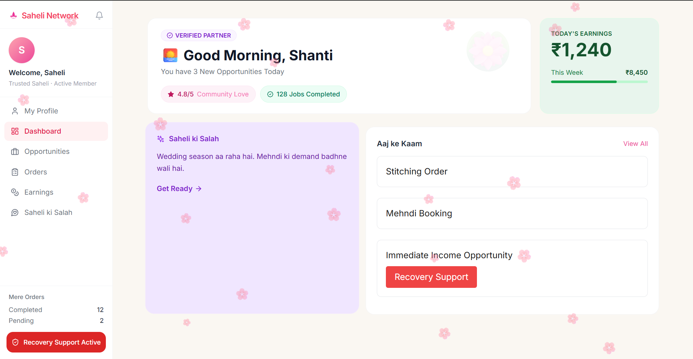
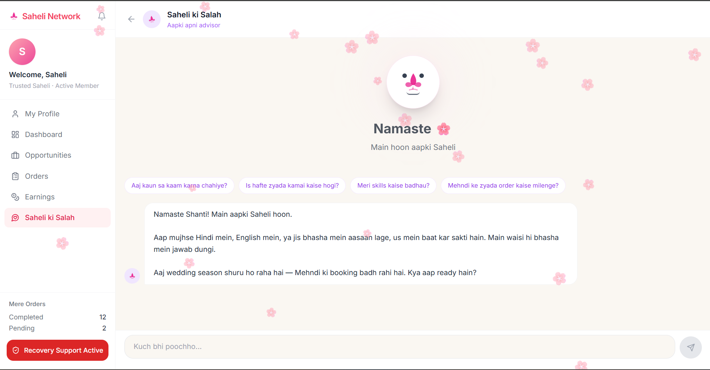
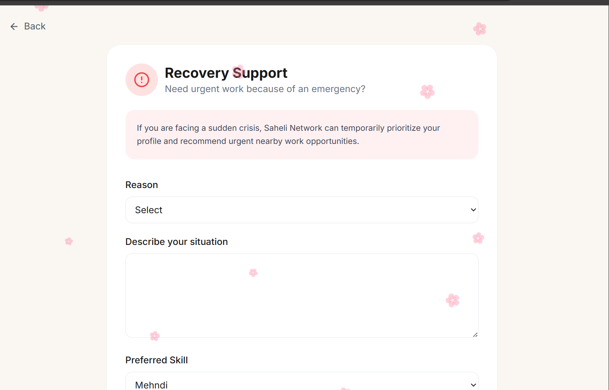

# 🌸 Saheli Network

**Empowering skilled women with nearby work opportunities, AI-powered guidance, and support when it matters most.**

Built for [Build for Good](https://www.samasocial.in/hackathon/build-for-good) — Sama Social's hackathon for socially impactful tech.

---

## The Idea

There's a woman who works at my home — hardworking, skilled at cooking and tailoring, well-liked by everyone she works for. But every new job she gets comes from word of mouth. There's no way for her to show what she can do beyond who happens to know her, and if something goes wrong — a medical emergency, a bad month — there's no safety net and no easy way to signal "I need work, urgently" to anyone who might have it.

That's the gap Saheli Network tries to close. It's a platform for skilled women in the informal sector — tailoring, mehndi, cooking, childcare, and more — to find nearby work, track what they've earned, get practical AI-backed advice for their specific situation, and ask for temporary priority when they're in a crisis.

## The Problem

Women working informally in small towns and rural areas often face:

- Work that depends entirely on word of mouth, with no way to reach people beyond their immediate circle
- No visibility into what's nearby, what pays well, or what's urgent
- No support system when a financial or family emergency hits
- No one giving them practical, personalized advice about their own work

## What Saheli Network Does

- **Finds nearby work** — filtered by skill, distance, and urgency, so she's not relying on chance
- **Tracks earnings** — daily, weekly, monthly, with a clear view of progress toward a goal
- **Gives real advice** — an AI assistant (Saheli ki Salah) that responds in her own language and ties suggestions to her actual skills, ratings, and the season
- **Offers Recovery Support** — a way to flag a genuine emergency and get temporarily prioritized for urgent nearby work
- **Builds trust** — verified profiles, ratings, and a track record that travels with her instead of resetting with every new client

---

## Screenshots

**Dashboard** — daily opportunities, earnings at a glance, and AI suggestions in one place


**Saheli ki Salah** — the AI advisor, responding in the same language she writes in


**Recovery Support** — a simple form to flag an emergency and get prioritized for urgent work


---

## Features

**Profile** — skills, ratings, completed jobs, monthly earnings, and work preferences in one place.

**Dashboard** — a personalized welcome (with a time-based greeting), today's earnings, weekly progress, an AI tip for the day, and a live Recovery Support banner when it's active.

**Opportunities** — nearby jobs filtered by category, with distance, timing, pay, and urgency clearly flagged.

**Orders** — everything in progress, completed, or pending, with customer and service details.

**Earnings** — today, this week, this month, a monthly goal tracker, and full history.

**Saheli ki Salah** — an AI assistant powered by Google's Gemini API. It replies in whatever language she writes in (Hindi, English, or Hinglish) and ties every suggestion to her real situation — her skills, her nearby jobs, the season.

**Recovery Support** — when something goes wrong, she can describe the emergency and get temporarily prioritized for urgent nearby work, no long forms or approval delays.

**Design** — an animated splash screen, smooth page transitions, soft pastel visuals, and a floating-petal motif throughout, aimed at feeling warm and trustworthy rather than transactional.

---

## Tech Stack

**Frontend:** React, Vite, Tailwind CSS, React Router, Framer Motion, Lucide React

**Backend:** FastAPI (Python)

**AI:** Google Gemini API

**Planned:** Firebase Authentication and Firestore, for real accounts and persistent data beyond this demo

---

## Project Structure

```
Saheli-Network
├── src
│   ├── components
│   ├── pages
│   └── services
├── backend
│   ├── main.py
│   ├── requirements.txt
│   └── .env
├── public
└── package.json
```

---

## Running It Locally

You'll need two terminals running at the same time — one for the frontend, one for the backend.

**Clone the repo**
```bash
git clone https://github.com/your-username/Saheli-Network.git
cd Saheli-Network
```

**Terminal 1 — Frontend**
```bash
npm install
npm run dev
```
Runs at `http://localhost:5173`

**Terminal 2 — Backend**
```bash
cd backend
pip install -r requirements.txt
```

Create a `.env` file inside `backend/`:
```env
GEMINI_API_KEY=YOUR_API_KEY
```

Then start the server:
```bash
python -m uvicorn main:app --reload
```
Runs at `http://localhost:8000`

---

## Demo Login

Phone number: `9876543210`

Press **Continue** — no OTP or verification needed for this demo.

---

## What's Next

- **Firebase Authentication + real accounts** — this demo uses a single hardcoded profile; real accounts are the natural next step before this could go live
- **Location-based matching** — right now "distance" is illustrative; real matching would use actual location data to surface genuinely nearby work
- **Regional language support beyond Hindi/English** — many of the women this is built for are more comfortable in other regional languages, and the AI advisor should meet them there too
- **A digital wallet or direct payment flow** — so earnings tracked in-app can actually be collected through it, not just recorded

---

## Built By

**Pragya Richa Pandey** — B.Tech Computer Science Engineering, solo build for Build for Good.

Made with care, for women who've been doing this work all along and deserve a better way to find it.
