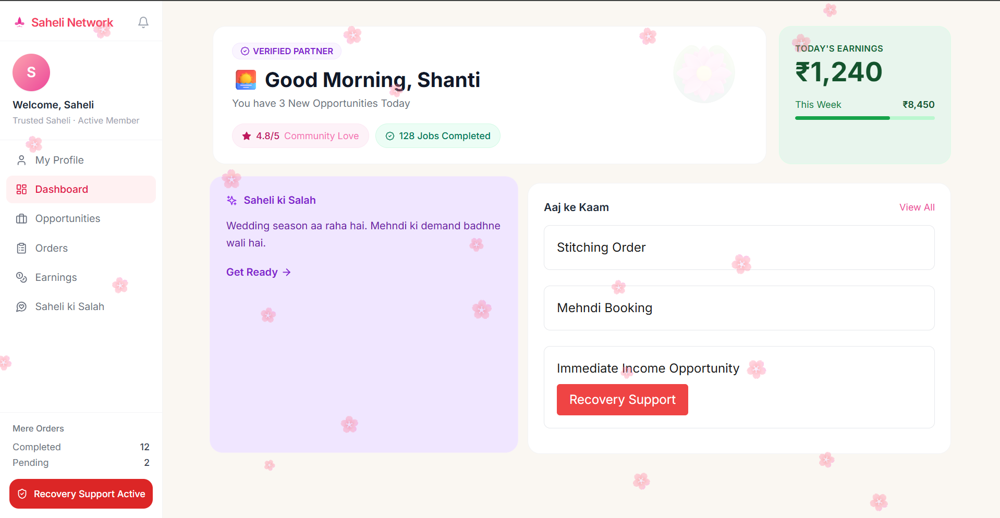
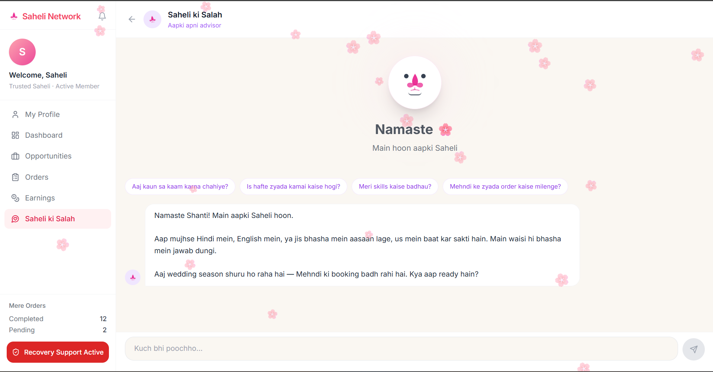
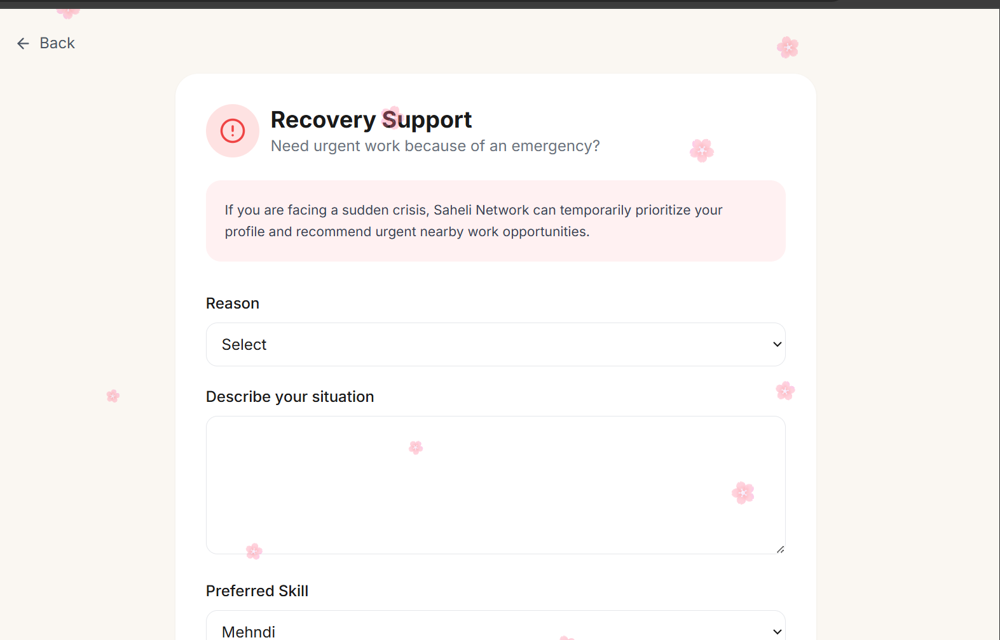
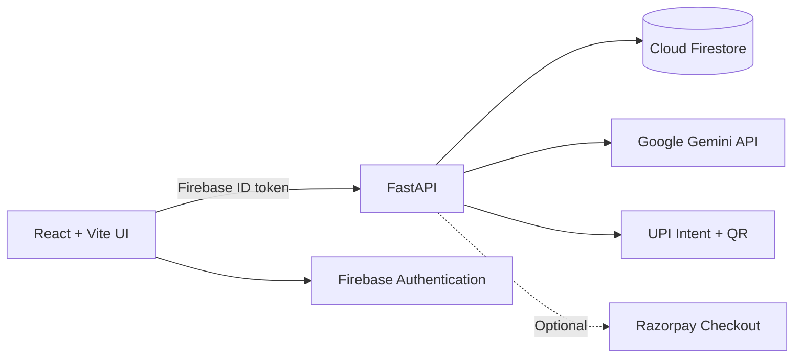

# 🌸 Saheli Network

### Hyperlocal work, trusted connections, and financial visibility for skilled women

[](https://react.dev/)
[](https://fastapi.tiangolo.com/)
[](https://firebase.google.com/)
[](https://ai.google.dev/)

**Saheli Network** is a women-first marketplace for rural and small-town communities. It connects women who already have practical skills—such as tailoring, mehndi, cooking, tuition, beauty services, cleaning, and childcare—with nearby people who need those services.

The platform supports the complete journey from discovering local work to applying, selecting a Saheli, navigating to the job, requesting an advance, confirming payment, tracking earnings, and receiving personalized guidance from **Saheli ki Salah**.

Built by **Pragya Richa Pandey** as a solo project for the national-level **Build for Good** hackathon by Sama Social, where it reached the grand finale.

---

## Why Saheli Network?

Many skilled women earn through informal, word-of-mouth networks. Their ability to find work often depends on who already knows them, while their work history, earnings, and reputation remain scattered or undocumented.

Saheli Network creates a simple digital bridge:

- Women can discover nearby paid work based on their skills.
- Customers can post a specific requirement and select an applicant.
- Both sides can follow one shared order and payment record.
- Workers can build a reusable profile, work history, ratings, and earnings record.
- The interface supports simple **Hinglish, Hindi, and English**.
- Women facing a sudden income disruption can activate **Recovery Support**.

---

## How It Works

Saheli Network supports two modes inside the same product.

### 👩‍🔧 Mujhe Kaam Chahiye

1. Create a profile with skills, area, availability, travel preference, portfolio, and UPI ID.
2. Browse posted work by category, pay, urgency, and distance.
3. Apply and track the application under **Orders**.
4. When selected, access the customer’s contact details and exact job location.
5. Open Google Maps directions from the order.
6. Request an advance payment when required.
7. Mark the work complete and confirm received payments.
8. Track confirmed earnings and reviews.

### 🤝 Mujhe Kaam Karwana Hai

1. Post a job with its category, budget, schedule, area, private address, and optional GPS location.
2. Review applicants and select one Saheli.
3. Track the assigned order and contact the selected worker.
4. Pay a requested advance using a universal UPI QR or UPI app.
5. Pay the remaining amount after completion.
6. Leave a rating and review.

> A user cannot apply to a job posted by the same account. Test the marketplace journey using two different accounts: one customer and one Saheli.

---

## Product Highlights

| Feature | What it does |
| --- | --- |
| **Firebase accounts** | Provides separate, persistent user accounts with protected sessions. |
| **Dual account modes** | Lets a user switch between finding work and hiring a Saheli. |
| **Personal profile** | Stores skills, location, availability, work preferences, portfolio, goal, and UPI ID. |
| **Opportunity matching** | Prioritizes jobs using skills, urgency, and calculated distance. |
| **Application workflow** | Connects apply → customer selection → shared order without demo-only state. |
| **Privacy-aware GPS** | Shows distance and approximate area before selection; reveals exact navigation only after assignment. |
| **Google Maps navigation** | Opens the posted area before selection and exact directions for an assigned order. |
| **Advance payments** | Allows an assigned Saheli to request part payment before starting work. |
| **UPI and QR payments** | Generates an amount-specific UPI intent that works with compatible UPI apps. |
| **Payment confirmation** | Records income only after the Saheli confirms receiving the payment. |
| **Earnings tracker** | Calculates today, week, month, total earnings, pending amounts, and goal progress. |
| **Saheli ki Salah** | Uses Gemini to give profile-aware guidance in accessible language. |
| **Recovery Support** | Saves a private support request for sudden income or personal crises. |
| **Notifications** | Records important application, selection, completion, and payment events. |
| **Multilingual interface** | Supports Hinglish, Hindi, and English while retaining the same familiar layout. |

---

## Screenshots

### Worker Dashboard

Daily opportunities, earnings, work progress, and personalized guidance in one place.



### Saheli ki Salah

An AI assistant that uses the worker’s saved profile and available opportunities to provide relevant guidance.



### Recovery Support

A simple way to record an urgent need for income support without navigating a complex form.



---

## Architecture


```mermaid
flowchart LR
    A[React + Vite UI] -->|Firebase ID token| B[FastAPI]
    A --> C[Firebase Authentication]
    B --> D[(Cloud Firestore)]
    B --> E[Google Gemini API]
    B --> F[UPI Intent + QR]
    B -. Optional .-> G[Razorpay Checkout]
```

The frontend never receives Firebase Admin credentials or Gemini secrets. Authenticated requests carry a Firebase ID token to FastAPI. The backend verifies the token, enforces record ownership and account mode, and performs trusted Firestore writes.

### Technology

- **Frontend:** React 18, Vite, Tailwind CSS, React Router, Framer Motion, Lucide React
- **Backend:** FastAPI, Pydantic, Uvicorn
- **Authentication and data:** Firebase Authentication and Cloud Firestore
- **AI:** Google Gemini API
- **Payments:** Universal UPI intent/QR with two-sided confirmation; optional Razorpay integration
- **Testing:** Pytest with an in-memory Firestore substitute

---

## Project Structure

```text
Saheli-Network/
├── backend/
│   ├── app.py                 # Authenticated API and business workflows
│   ├── domain.py              # Earnings and distance calculations
│   ├── main.py                # FastAPI entry point
│   ├── requirements.txt
│   └── tests/
├── screenshots/
├── scripts/
│   └── dev.mjs                # Starts frontend and backend together
├── src/
│   ├── components/
│   ├── i18n/
│   ├── pages/
│   └── services/
├── firestore.rules
├── SETUP.md
└── package.json
```

---

## Run Locally

### Prerequisites

- Node.js 18 or newer
- Python 3.10 or newer
- A Firebase project with Email/Password Authentication and Firestore
- A Firebase Admin service-account file stored **outside** the repository
- A Gemini API key for **Saheli ki Salah**

### 1. Clone and install the frontend

```powershell
git clone https://github.com/pragya-pp08/Saheli-Network.git
cd Saheli-Network
npm install
```

### 2. Prepare the backend once

```powershell
cd backend
python -m venv .venv
.venv\Scripts\python.exe -m pip install -r requirements.txt
cd ..
```

### 3. Configure environment variables

Copy `backend/.env.example` to `backend/.env`, then provide your own values:

```dotenv
FIREBASE_PROJECT_ID=your-firebase-project-id
GOOGLE_APPLICATION_CREDENTIALS=C:/private/your-service-account.json
ALLOWED_ORIGINS=http://localhost:5173,http://127.0.0.1:5173
GEMINI_API_KEY=your-gemini-api-key
GEMINI_MODEL=gemini-3.5-flash-lite
```

Never commit `.env` or the service-account JSON file.

### 4. Start the complete application

```powershell
npm run dev
```

This starts both services and opens the app automatically:

- Web app: `http://127.0.0.1:5173`
- API: `http://127.0.0.1:8000`

Detailed Firebase, Firestore, payment, and deployment instructions are available in [SETUP.md](./SETUP.md).

---

## Test the Complete Journey

Use two separate accounts or browser profiles:

1. **Customer account:** choose *Mujhe Kaam Karwana Hai* and post a job with GPS enabled.
2. **Saheli account:** choose *Mujhe Kaam Chahiye*, open Opportunities, and apply.
3. **Customer:** open the posted job and select the applicant.
4. **Saheli:** open Orders to view the exact location, navigate, or request an advance.
5. **Customer:** open the order and pay the advance using UPI/QR.
6. **Saheli:** confirm receipt, complete the work, and mark it completed.
7. **Customer:** pay the remaining amount and leave a review.
8. **Saheli:** verify that confirmed income appears under Earnings.

Run the automated checks with:

```powershell
npm run build
cd backend
.venv\Scripts\python.exe -m pytest tests -q
```

---

## Payment and Location Safety

- Exact customer coordinates, address, and phone number are withheld until a Saheli is selected.
- Before assignment, workers see the public area and calculated distance only.
- Personal UPI transfers are confirmed by both participants. Saheli Network cannot independently verify a bank transfer without a payment provider.
- Advance and final-payment records do not count as received earnings until the worker confirms receipt.
- Razorpay support is optional and requires the platform owner to configure a merchant account, webhook, reconciliation, and worker payout process.

---

## Current Product Status

This repository contains a connected, functional MVP rather than a static UI prototype. Authentication, profiles, jobs, applications, orders, GPS distance, navigation, advance requests, UPI confirmation, earnings, reviews, notifications, recovery records, multilingual UI, and Gemini guidance are backed by authenticated APIs and persistent Firestore records.

Before a public production launch, the project still needs operational verification and moderation, dispute and refund workflows, bank-verified marketplace settlements, rate limiting, pagination, accessibility testing, monitoring, and a full staging security review. The current “trusted” presentation is a product concept and does not represent government identity verification.

---

## Vision

Saheli Network is designed to help skilled women turn informal ability into visible, repeatable, and trusted earning opportunities—without requiring advanced digital literacy.

The goal is simple: **nearby work, safer coordination, clearer earnings, and more control over when and how a woman earns.**

---

## Creator

**Pragya Richa Pandey**

B.Tech Computer Science Engineering · Solo creator and developer of Saheli Network

Made with care for women whose skills already create value—and deserve a wider network.
